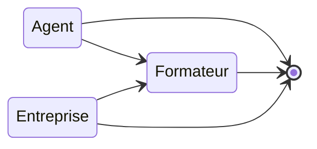

# Micro-service Nest

Ce projet démontre l'utilisation de Microservices avec 2 API [NestJS](https://nestjs.com/).

L'aggregation des résultats se fait via la gateway [KrakenD](https://www.krakend.io/).

> La configuration de la gateway est disponnible [ici](./config/krakend.json)

## Routes

- [http://localhost:8000/agents](http://localhost:8000/agents): Liste des agents
- [http://localhost:8000/entreprises](http://localhost:8000/entreprises): liste des entreprises
- [http://localhost:8000/formateurs/{id}](http://localhost:8000/formateurs/{id}): aggrégation d'un agent et son entreprise qui constitue un formateur

## Installer les dépendances

Pour chacuns des microservices (agents, entreprises), se placer dans le repertoire et lancer:
`npm install`

## Lancer la stack

A la racine du projet lancer: `docker-compose up` pour lancer les conteneurs Docker.

> `docker compose up -d --build` permet de lancer la stack en mode discret en forçant la construction des images Docker.

## Dépendances

- Docker
- NodeJS
